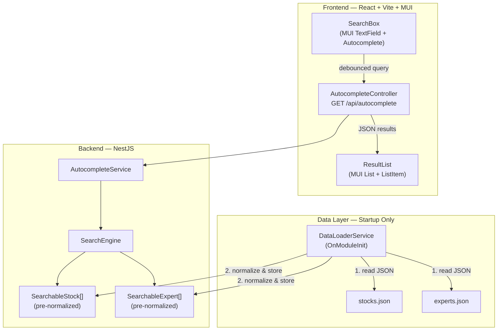
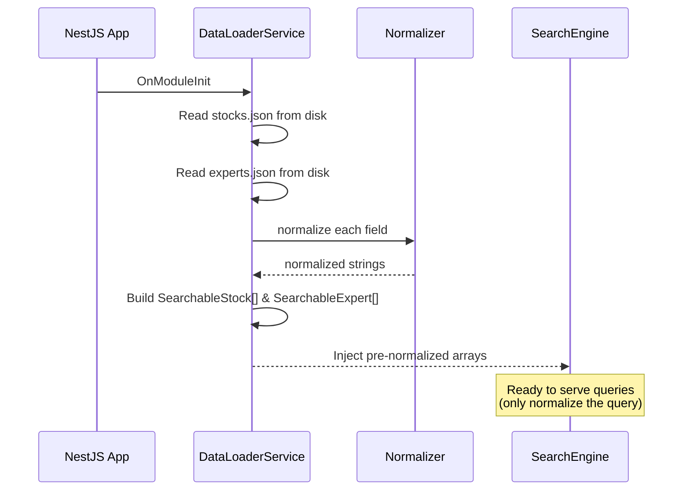

# TipRanks Autocomplete API — Architecture & Design Document (v3)

## 1. Goal

Build a clean, scalable autocomplete API (NestJS + TypeScript) that returns relevant search results for stocks and experts (analysts, bloggers, insiders), paired with a React frontend (with MUI) for searching and displaying grouped results with match highlighting.

---

## 2. Data Analysis & Normalization Issues

Before any design decisions, I audited both JSON files for search-hostile patterns. Here's what I found:

### 2.1 Stocks Data Issues

| Issue | Examples | Impact on Search |
|-------|----------|-----------------|
| **`&` (ampersand) in names** | `"JPMorgan Chase & Co."`, `"Johnson & Johnson"`, `"Procter & Gamble Company"`, `"Wells Fargo & Company"`, `"Merck & Company"` | Users will type `"johnson and johnson"` or `"johnson johnson"` — raw substring match on `&` will miss. The JSON stores these as `\u0026` (JSON unicode escape for `&`). |
| **`.` (periods) in tickers** | `"BRK.A"`, `"BRK.B"` | Users may type `"BRKA"` or `"BRK A"` or `"BRK.A"`. Need to normalize by stripping dots. |
| **`:` (colon) in tickers** | `"JP:3350"`, `"GB:0GWL"`, `"GB:AZN"` | International tickers use `exchange:symbol` format. A user searching `"3350"` or `"AZN"` should match. Need to also search the suffix after `:`. |
| **`.com` in names** | `"Amazon.Com, Inc."`, `"Salesforce.com"` | Periods embedded in company names; users will type `"amazon"` or `"salesforce"` — substring match handles this but exact/prefix matching must normalize. |
| **Inconsistent casing** | `"Ge Aerospace"`, `"Asml Holding N.V."`, `"HSBC Holdings plc"` | Mixed casing across entries — all matching must be case-insensitive. |
| **Extra spaces** | `"Agricultural Bank of China  Class H"` (double space), `"T Mobile US"` (missing hyphen — should be T-Mobile?) | Must collapse whitespace for consistent matching. |
| **Accented characters** | `"Nestlé"` (é), `"L'Oreal SA"` (apostrophe) | Users will type `"nestle"` (no accent) or `"loreal"` (no apostrophe). Need to strip diacritics and normalize punctuation. |

### 2.2 Experts Data Issues

| Issue | Examples | Impact on Search |
|-------|----------|-----------------|
| **Titles/suffixes in names** | `"Scott Chan CFA"`, `"Dr. Paul Nunzio De Santis"`, `"Michael E. Marks"` | Searching `"scott chan"` should match despite `CFA` suffix. `"paul de santis"` should match despite `Dr.` prefix. |
| **Non-human entity as name** | `"Citron Research"` | Not a person name — works fine with substring but worth noting for the business logic. |
| **`type` field collision** | Source JSON uses `"type": "Analyst"` — `type` is a generic/reserved word and collides with our result schema's `type` (which is `"stock"` / `"expert"`). | Must rename to `expertType` in the API response and lowercase the value. |

### 2.3 Normalization Strategy

We'll build a **normalization pipeline** applied **once at index time** (startup) and only to the **query** at request time:

```
Input → lowercase → strip diacritics → replace & with "and" → strip punctuation (except spaces) → collapse whitespace
```

For tickers specifically, we also **strip all non-alphanumeric** to produce a secondary search key: `"BRK.A"` → `"brka"`, `"JP:3350"` → `"jp3350"`.

> [!IMPORTANT]
> **Pre-computed normalization (v2 change):** All normalized fields are computed once when the JSON files are loaded into memory at startup. They are stored as part of the in-memory index structures (`SearchableStock`, `SearchableExpert`). At query time, **only the user's query** is normalized — the data is never re-normalized. This eliminates redundant CPU work on every request.

---

## 3. Architecture Overview



### 3.1 In-Memory Data Structures (Pre-Normalized)

At startup, each JSON record is enriched with pre-computed normalized search keys:

```typescript
// What gets stored in memory for each stock
interface SearchableStock {
  // Original fields (for API response)
  ticker: string;          // "BRK.A"
  name: string;            // "Berkshire Hathaway A"
  marketCap: number;       // 1061814716499

  // Pre-computed normalized fields (for search matching)
  normalizedTicker: string;       // "brk.a"
  normalizedTickerClean: string;  // "brka" (dots/colons stripped)
  tickerSuffix: string | null;    // null (or "3350" for "JP:3350")
  normalizedName: string;         // "berkshire hathaway a"
}

// What gets stored in memory for each expert
interface SearchableExpert {
  // Original fields (for API response)
  name: string;            // "Dr. Paul Nunzio De Santis"
  expertType: string;      // "blogger" (already lowercased from "Blogger")

  // Pre-computed normalized field (for search matching)
  normalizedName: string;  // "dr paul nunzio de santis"
}
```

**Why this matters**: On a query like `"brk"`, we simply normalize the query once → `"brk"`, then do fast `startsWith` / `includes` checks against the pre-computed `normalizedTicker`, `normalizedTickerClean`, and `normalizedName` strings. No normalization of the 200 records happens per request.

### 3.2 Startup Data Flow



### 3.3 Monorepo Structure

```
TipRanks/
├── stocks.json                    # Source data
├── experts.json                   # Source data
├── backend/                       # NestJS API
│   ├── src/
│   │   ├── main.ts                # Bootstrap + CORS
│   │   ├── app.module.ts          # Root module
│   │   ├── autocomplete/
│   │   │   ├── autocomplete.module.ts
│   │   │   ├── autocomplete.controller.ts   # GET /api/autocomplete
│   │   │   ├── autocomplete.service.ts      # Orchestrates search + merging
│   │   │   └── dto/
│   │   │       ├── autocomplete-query.dto.ts  # Input validation
│   │   │       └── autocomplete-result.dto.ts # Response shape
│   │   ├── search/
│   │   │   ├── search.module.ts
│   │   │   ├── search-engine.service.ts      # Core search logic (query-only normalization)
│   │   │   ├── normalizer.util.ts            # Text normalization pipeline
│   │   │   └── interfaces/
│   │   │       └── searchable.interface.ts   # SearchableStock, SearchableExpert
│   │   └── data/
│   │       ├── data.module.ts
│   │       └── data-loader.service.ts        # Loads & pre-normalizes JSON at startup
│   ├── test/
│   │   ├── autocomplete.e2e-spec.ts
│   │   └── search-engine.spec.ts
│   ├── package.json
│   ├── tsconfig.json
│   └── nest-cli.json
├── frontend/                      # React + Vite + MUI
│   ├── src/
│   │   ├── App.tsx
│   │   ├── main.tsx
│   │   ├── theme.ts               # MUI theme configuration
│   │   ├── components/
│   │   │   ├── SearchBox.tsx       # MUI TextField with custom autocomplete
│   │   │   ├── ResultList.tsx      # MUI List, ListItem, ListSubheader
│   │   │   ├── ResultItem.tsx      # Individual result row
│   │   │   └── HighlightedText.tsx # MUI Typography with <mark> spans
│   │   ├── hooks/
│   │   │   └── useAutocomplete.ts  # Debounced API fetch hook
│   │   ├── types/
│   │   │   └── index.ts
│   │   ├── __tests__/              # Frontend component tests
│   │   │   ├── setup.ts            # Test setup (jsdom, cleanup)
│   │   │   ├── SearchBox.test.tsx
│   │   │   ├── ResultList.test.tsx
│   │   │   ├── HighlightedText.test.tsx
│   │   │   └── useAutocomplete.test.ts
│   │   └── index.css              # Minimal global resets
│   ├── index.html
│   ├── package.json
│   ├── tsconfig.json
│   └── vite.config.ts
└── README.md
```

---

## 4. Key Technical Decisions

### 4.1 Data Storage: In-Memory with Pre-Computed Normalization (No Database)

**Decision**: Load both JSON files into memory at application startup. Pre-compute all normalized search fields and store them alongside original data.

**Rationale**:
- **Dataset size**: ~100 stocks + ~100 experts ≈ 200 records. This comfortably fits in memory (< 100KB, ~200KB with normalized fields).
- **Read pattern**: Autocomplete is 100% reads, 0% writes during runtime. No ACID guarantees needed.
- **Latency**: In-memory search is O(n) on a tiny dataset — sub-millisecond. Any DB would add network round-trip overhead (~1-5ms) for zero benefit.
- **Pre-normalization**: Normalizing ~200 records once at startup (< 1ms) vs. normalizing them on every request would waste CPU. With pre-computed fields, each query only normalizes the user's input string (one normalization per request instead of ~200).
- **Simplicity**: No MongoDB/PostgreSQL setup, no connection pooling, no ORM, no migrations. This dramatically reduces operational complexity.
- **Scalability path**: If the dataset grows to 100K+ records, we'd swap in **Elasticsearch** or **PostgreSQL with trigram indexes** — the `SearchEngine` service is an abstraction that makes this a drop-in replacement.

> [!NOTE]
> The `SearchEngine` service is designed as a pluggable interface. Migrating to a database or Elasticsearch later requires only swapping the implementation, not touching the controller or service layers.

### 4.2 Search Algorithm: Pre-computed Normalized Index with Tiered Matching

**Decision**: Build a normalized search index at startup; match against it using a 3-tier scoring system.

**How it works**:

1. **Index Time** (once, on startup via `DataLoaderService`):
   - For each stock, pre-compute: `normalizedTicker`, `normalizedTickerClean`, `tickerSuffix`, `normalizedName`
   - For each expert, pre-compute: `normalizedName` and lowercase `expertType`
   - All stored as properties on the in-memory objects

2. **Query Time** (per request — lightweight):
   - Normalize the query **once** using the same pipeline
   - Linear scan over pre-normalized arrays, comparing against pre-computed fields:

| Tier | Priority | Condition | Example |
|------|----------|-----------|---------|
| **1 — Exact** | Highest | Normalized query === pre-normalized field | `"aapl"` matches `normalizedTicker: "aapl"` |
| **2 — Prefix** | Medium | Pre-normalized field starts with normalized query | `"app"` matches `normalizedName: "apple inc"` |
| **3 — Substring** | Lowest | Pre-normalized field contains normalized query | `"pple"` matches `normalizedName: "apple inc"` |

3. **Tie-breaking within the same tier**:
   - Stocks: by `marketCap` descending (largest first) — most recognizable companies surface first
   - Experts: alphabetical by name — deterministic and predictable

**Why not a Trie?** A trie optimizes prefix lookups to O(m) where m = query length. But with ~200 records, a linear scan is faster than the overhead of trie traversal due to CPU cache locality. Tries also don't support substring matching without augmentation.

### 4.3 Result Mixing Rule: 5/5 Split with Fallback

**Decision**: Return up to **10 results total**, with a **balanced mix** of stocks and experts.

**Algorithm**:
1. Search stocks → get all matches, sorted by tier then marketCap
2. Search experts → get all matches, sorted by tier then name
3. Take up to **5 stocks** and up to **5 experts**
4. **Fallback**: If one type has fewer than 5 matches, give the remaining slots to the other type
   - Example: 3 stock matches + 12 expert matches → 3 stocks + 7 experts = 10 total
   - Example: 8 stock matches + 0 expert matches → 8 stocks (capped at 10)
5. Interleave results: first sort by tier (exact matches from both types appear first), then within the same tier alternate between types

**Rationale**: A pure "top 10 by score" approach would let stocks (which have more match surfaces — ticker + name) crowd out experts. The 5/5 split ensures visibility for both types. The fallback prevents wasting slots.

### 4.4 Backend Framework: NestJS

**Decision**: NestJS with TypeScript, following modular architecture.

**Rationale**:
- **Explicit requirement** from the task specification
- **Module system**: Clean separation of concerns — `AutocompleteModule`, `SearchModule`, `DataModule`
- **Dependency Injection**: Services are injectable, testable, and mockable
- **Validation**: Built-in `class-validator` + `class-transformer` for DTO validation
- **Pipes**: `ValidationPipe` globally enforces input validation

### 4.5 Frontend: React + Vite + MUI

**Decision**: React SPA with Vite for tooling and **Material UI (MUI)** for the component library.

**Rationale**:
- **Vite**: Fastest dev server startup, instant HMR. No SSR needed for a search box.
- **MUI**: Production-grade component library providing consistent, accessible, and visually polished UI out of the box. Eliminates the need for hand-crafted CSS for common patterns (inputs, lists, chips, typography).
- **No heavy state management**: A single `useAutocomplete` custom hook with `useState` + `useEffect` is sufficient.
- **Debouncing**: 300ms debounce on keystrokes to avoid API spam. Using a simple custom implementation (no lodash dependency).

**MUI Components Used**:

| MUI Component | Usage |
|---------------|-------|
| `TextField` | Search input field with search adornment icon |
| `Paper` | Dropdown container for results |
| `List` / `ListItem` / `ListItemText` | Individual result rows |
| `ListSubheader` | "Stocks" / "Experts" group headers |
| `Typography` | Text rendering with `<mark>` spans for highlighting |
| `Chip` | Expert type badge (analyst / insider / blogger) |
| `CircularProgress` | Loading spinner during fetch |
| `Box` / `Container` | Layout wrappers |
| `ThemeProvider` + `CssBaseline` | Global theming and CSS reset |

**Theme**: Dark mode with a modern color palette. Custom `theme.ts` file configures MUI's `createTheme` with brand colors.

### 4.6 Input Validation & Security

| Concern | Solution |
|---------|----------|
| Empty query | Return `[]` immediately (no processing) |
| Query too long | Reject queries > 100 characters with 400 Bad Request |
| Special characters in query | Normalize/strip them — never pass raw input to regex or DB |
| XSS via query param | Query is never rendered as HTML; results are rendered via React's JSX (auto-escapes) |
| Rate limiting | Not implemented for this scope, but NestJS has `@nestjs/throttler` for production |

---

## 5. API Design

### 5.1 Endpoint

```
GET /api/autocomplete?query={text}
```

### 5.2 Response Schema

```typescript
// Stock result
{
  type: "stock",
  ticker: string,
  name: string,
  marketCap: number
}

// Expert result
{
  type: "expert",
  name: string,
  expertType: "analyst" | "insider" | "blogger"
}
```

### 5.3 Response Convention

The API returns results **interleaved by score** (not pre-grouped). The frontend is responsible for grouping by `type` for display purposes. This gives the frontend flexibility to display results in different layouts without being locked to a server-side grouping format.

### 5.4 Edge Cases

| Input | Expected Output |
|-------|----------------|
| `query=` (empty) | `[]` |
| `query=AAPL` | Exact ticker match — Apple Inc first |
| `query=brk` | Prefix match on both `BRK.A` and `BRK.B` |
| `query=johnson` | Matches `"Johnson & Johnson"` (& normalized to "and") |
| `query=nestle` | Matches `"Nestlé"` (diacritics stripped) |
| `query=dr paul` | Matches `"Dr. Paul Nunzio De Santis"` |
| `query=3350` | Matches `"JP:3350"` (colon-suffix indexed) |
| `query=a` | Mixed results — stocks starting with "A" by ticker (AAPL, AMZN, AMD, etc.) + experts starting with "A" by name |

---

## 6. Search Ranking — Detailed Algorithm

```
function rank(normalizedQuery, item):
    // item.normalizedFields are PRE-COMPUTED (no normalization here)
    
    for each pre-normalized searchable field in item:
        if field === normalizedQuery → tier = 1 (EXACT)
        else if field.startsWith(normalizedQuery) → tier = 2 (PREFIX)
        else if field.includes(normalizedQuery) → tier = 3 (SUBSTRING)
    
    bestTier = min(all matched tiers)  // lower tier number = better match
    
    return { item, bestTier, matchedField }
```

**Merge & output**:
```
1. Normalize query ONCE
2. Scan all SearchableStock[] → compare against pre-normalized fields → sort by (tier ASC, marketCap DESC)
3. Scan all SearchableExpert[] → compare against pre-normalized fields → sort by (tier ASC, name ASC)
4. Take min(5, stockMatches.length) stocks
5. Take min(5, expertMatches.length) experts  
6. If total < 10, fill remaining from whichever type has more
7. Final sort: by tier ASC, then stocks-before-experts within same tier
8. Return top 10
```

---

## 7. Frontend Design (MUI)

### 7.1 Components

| Component | MUI Components Used | Responsibility |
|-----------|-------------------|---------------|
| `App` | `ThemeProvider`, `CssBaseline`, `Container` | Root layout with MUI theme |
| `SearchBox` | `TextField`, `InputAdornment`, `SearchIcon` | Search input with icon, debounced `onChange` |
| `ResultList` | `Paper`, `List`, `ListSubheader` | Groups results under "Stocks" / "Experts" headers |
| `ResultItem` | `ListItem`, `ListItemText`, `Chip` | Individual result row — stock shows ticker + name + market cap, expert shows name + type chip |
| `HighlightedText` | `Typography`, `<mark>` spans | Wraps matched substring for visual highlighting |

### 7.2 UI Mockup Structure

```
┌─────────────────────────────────────────────────┐
│  🔍  Search stocks & experts...                 │  ← MUI TextField
├─────────────────────────────────────────────────┤
│  STOCKS                                         │  ← MUI ListSubheader
│  ┌─────────────────────────────────────────────┐│
│  │ AAPL    [Apple] Inc          $3.9T          ││  ← MUI ListItem
│  │ AMZN    [Amazon].Com, Inc.   $2.4T          ││    highlight in []
│  │ AMD     [A]dvanced Micro     $410B          ││
│  └─────────────────────────────────────────────┘│
│  EXPERTS                                        │  ← MUI ListSubheader
│  ┌─────────────────────────────────────────────┐│
│  │ [A]ndrew Bary         🏷️ blogger            ││  ← Chip for type
│  │ [A]ndrew Kaip         🏷️ analyst            ││
│  │ [A]lan Ridgeway       🏷️ analyst            ││
│  └─────────────────────────────────────────────┘│
└─────────────────────────────────────────────────┘
```

### 7.3 UX Decisions

- **Debounce**: 300ms delay after last keystroke before firing API call
- **Loading state**: MUI `CircularProgress` spinner while request is in flight
- **Empty state**: "No results found" message when query has no matches
- **Grouping**: Frontend receives interleaved results, groups them by `type` into two sections
- **Highlight**: The matched portion of text is wrapped in `<mark>` with theme accent color
- **Market cap formatting**: Large numbers formatted as `$3.9T`, `$410B`, etc.
- **Expert type**: Displayed as a small MUI `Chip` (colored by type)
- **Keyboard nav**: Not in initial scope, but MUI components support it natively

---

## 8. Proposed Changes

### Backend (NestJS)

---

#### [NEW] `backend/` — NestJS application

Core modules:

#### [NEW] [autocomplete.controller.ts](file:///Users/yanivhayun/Dev-Test/TipRanks/backend/src/autocomplete/autocomplete.controller.ts)
- `GET /api/autocomplete?query=` endpoint
- Uses `ValidationPipe` to validate query DTO
- Returns typed response array

#### [NEW] [autocomplete.service.ts](file:///Users/yanivhayun/Dev-Test/TipRanks/backend/src/autocomplete/autocomplete.service.ts)
- Orchestrates search across both data types
- Implements the 5/5 merge rule with fallback
- Final sorting by tier

#### [NEW] [search-engine.service.ts](file:///Users/yanivhayun/Dev-Test/TipRanks/backend/src/search/search-engine.service.ts)
- Core search logic: normalizes **only the query**, then matches against pre-normalized fields
- Exposes `searchStocks(query)` and `searchExperts(query)` methods
- No data loading or normalization — receives pre-built indexes via DI

#### [NEW] [normalizer.util.ts](file:///Users/yanivhayun/Dev-Test/TipRanks/backend/src/search/normalizer.util.ts)
- Text normalization pipeline (lowercase, diacritics, ampersand, punctuation, whitespace)
- Ticker normalization (strip dots, colons)
- Pure functions, no side effects — used by both `DataLoaderService` (at startup) and `SearchEngine` (for query)

#### [NEW] [searchable.interface.ts](file:///Users/yanivhayun/Dev-Test/TipRanks/backend/src/search/interfaces/searchable.interface.ts)
- Defines `SearchableStock` and `SearchableExpert` interfaces with both original and pre-normalized fields

#### [NEW] [data-loader.service.ts](file:///Users/yanivhayun/Dev-Test/TipRanks/backend/src/data/data-loader.service.ts)
- Reads `stocks.json` and `experts.json` from disk at startup (`OnModuleInit`)
- Runs normalization pipeline on each record's searchable fields
- Builds `SearchableStock[]` and `SearchableExpert[]` with pre-computed normalized fields
- Exposes typed arrays to `SearchEngine` via DI

---

### Frontend (React + Vite + MUI)

---

#### [NEW] `frontend/` — React + Vite + MUI application

#### [NEW] [theme.ts](file:///Users/yanivhayun/Dev-Test/TipRanks/frontend/src/theme.ts)
- MUI `createTheme` configuration — dark mode, brand colors, typography

#### [NEW] [App.tsx](file:///Users/yanivhayun/Dev-Test/TipRanks/frontend/src/App.tsx)
- `ThemeProvider` + `CssBaseline` wrapper
- Main layout with `Container`, renders `SearchBox` and `ResultList`

#### [NEW] [useAutocomplete.ts](file:///Users/yanivhayun/Dev-Test/TipRanks/frontend/src/hooks/useAutocomplete.ts)
- Custom hook: debounced fetch to `/api/autocomplete`
- Manages `results`, `loading`, `error` state

#### [NEW] [SearchBox.tsx](file:///Users/yanivhayun/Dev-Test/TipRanks/frontend/src/components/SearchBox.tsx)
- MUI `TextField` with `InputAdornment` (search icon)
- Controlled input with `onChange` callback

#### [NEW] [ResultList.tsx](file:///Users/yanivhayun/Dev-Test/TipRanks/frontend/src/components/ResultList.tsx)
- Groups API results by `type` client-side
- MUI `Paper` + `List` with `ListSubheader` for "Stocks" / "Experts"

#### [NEW] [ResultItem.tsx](file:///Users/yanivhayun/Dev-Test/TipRanks/frontend/src/components/ResultItem.tsx)
- MUI `ListItem` + `ListItemText` for individual results
- Stock: ticker, highlighted name, formatted market cap
- Expert: highlighted name, MUI `Chip` for expert type

#### [NEW] [HighlightedText.tsx](file:///Users/yanivhayun/Dev-Test/TipRanks/frontend/src/components/HighlightedText.tsx)
- Finds query substring in display text (case-insensitive)
- Wraps matched portion in `<mark>` with theme accent styling

---

### Frontend Tests

---

#### [NEW] [setup.ts](file:///Users/yanivhayun/Dev-Test/TipRanks/frontend/src/__tests__/setup.ts)
- Test environment setup: jsdom, `@testing-library/jest-dom` matchers, cleanup after each test

#### [NEW] [SearchBox.test.tsx](file:///Users/yanivhayun/Dev-Test/TipRanks/frontend/src/__tests__/SearchBox.test.tsx)
- Renders the MUI TextField with placeholder text
- Fires `onChange` callback when user types
- Verifies debounce behavior (callback not fired immediately, fired after delay)

#### [NEW] [ResultList.test.tsx](file:///Users/yanivhayun/Dev-Test/TipRanks/frontend/src/__tests__/ResultList.test.tsx)
- Renders grouped results under "Stocks" and "Experts" subheaders
- Displays stock ticker, name, and formatted market cap
- Displays expert name and type chip
- Renders empty state when no results
- Handles mixed results (both types present)
- Handles single-type results (only stocks or only experts)

#### [NEW] [HighlightedText.test.tsx](file:///Users/yanivhayun/Dev-Test/TipRanks/frontend/src/__tests__/HighlightedText.test.tsx)
- Wraps matching substring in `<mark>` element
- Case-insensitive matching (query `"app"` highlights `"App"` in `"Apple Inc"`)
- No highlight when query doesn't match
- Handles empty query (renders plain text)
- Handles multiple potential matches (highlights first occurrence)

#### [NEW] [useAutocomplete.test.ts](file:///Users/yanivhayun/Dev-Test/TipRanks/frontend/src/__tests__/useAutocomplete.test.ts)
- Returns empty results for empty query (no API call made)
- Fetches from `/api/autocomplete?query=...` on query change
- Debounces rapid query changes (only last query triggers fetch)
- Sets `loading` state during fetch
- Sets `error` state on network failure
- Parses and returns typed results

**Testing Stack**:

| Tool | Purpose |
|------|--------|
| **Vitest** | Test runner — native Vite integration, fast, Jest-compatible API |
| **React Testing Library** (`@testing-library/react`) | Component rendering and DOM queries |
| **@testing-library/jest-dom** | Custom matchers (`toBeInTheDocument`, `toHaveTextContent`) |
| **@testing-library/user-event** | Simulating realistic user interactions (typing, clicking) |
| **jsdom** | Browser environment simulation for Vitest |
| **MSW (Mock Service Worker)** | Intercepts `fetch` calls to mock API responses without coupling tests to implementation details |

> [!NOTE]
> **Why MSW over manual fetch mocks?** MSW intercepts at the network level, so `useAutocomplete` tests exercise the real `fetch` call path. This catches issues like wrong URLs, missing headers, or JSON parse errors that `vi.fn()` mocks would silently pass.

---

## 9. Verification Plan

### Automated Tests

```bash
# Backend: unit tests for search engine and normalizer
cd backend && npm run test

# Backend: E2E test for the autocomplete endpoint
cd backend && npm run test:e2e

# Frontend: component and hook tests
cd frontend && npm run test
```

**Backend test cases**:
- Exact ticker match (`AAPL` → Apple first)
- Prefix match (`app` → Apple, AppLovin)
- Substring match (`pple` → Apple)
- Ampersand normalization (`johnson and johnson` → matches)
- Dot-ticker normalization (`brka` → matches `BRK.A`)
- Colon-ticker matching (`3350` → matches `JP:3350`)
- Accent normalization (`nestle` → matches `Nestlé`)
- Empty query → empty array
- Mix rule: verify both types appear when both match
- Result cap at 10

**Frontend test cases**:
- SearchBox renders and fires debounced callbacks
- ResultList groups and displays stocks and experts correctly
- HighlightedText marks the correct substring
- useAutocomplete hook debounces, fetches, and handles errors
- Empty/loading/error states render properly

### Manual Verification

1. Start backend: `cd backend && npm run start:dev`
2. Start frontend: `cd frontend && npm run dev`
3. Test in browser:
   - Type `a` → see mixed stocks and experts
   - Type `AAPL` → see Apple as first result (exact match)
   - Type `johnson` → see Johnson & Johnson
   - Type `brk` → see both BRK.A and BRK.B
   - Type `nestle` → see Nestlé
   - Verify highlighting matches the query substring
   - Verify results are grouped under "Stocks" / "Experts" headers with MUI styling

---

## Resolved Questions

| Question | Resolution |
|----------|-----------|
| Q1: Index colon-suffix in tickers? | ✅ Yes — extract and index the suffix after `:` |
| Q2: Search experts by firm? | ❌ No — name-only per spec |
| Q3: API response format? | ✅ Interleaved by score — frontend handles grouping |
| Q4: Deployment? | ⏳ Later — skip for now |
